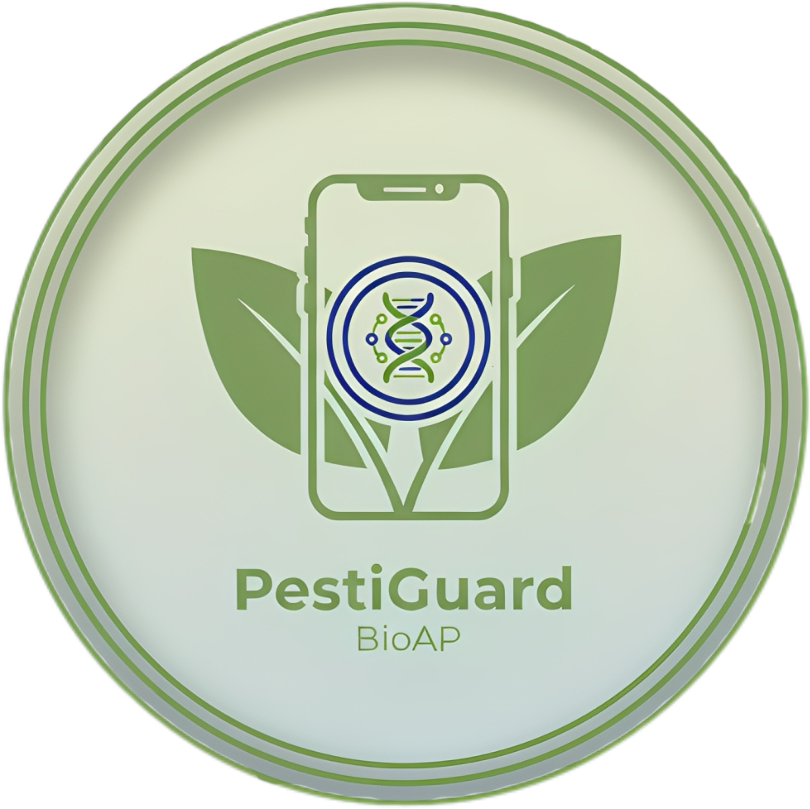

## BioAP — Biosensor Analysis Platform

BioAP helps quantify pesticide concentration from an uploaded or captured image of biosensor (PestiGuard sub-application). 
It computes RGB totals, calculated concentrations using calibration curves, classifies results into Low/Medium/High bands, and stores runs for data management.

**Important!** BioAP is now avaliable on: https://bioap.26650078.xyz



### Features
- **Analysis**: Upload/capture an image, auto-place N points, optionally enable background normalization, compute concentrations, and view results.
- **Calibration**: Edit per‑pesticide calibration points; in Customize mode, manage pesticides and thresholds.
- **History**: Browse, search, view details, rename, delete, and export past runs.
- **Settings**: Switch Default/Customize modes, toggle light/dark theme, and clear data.
- **Import/Export**: Export a run as JSON; import/export calibration profiles.

### Requirements
- **Python**: 3.13+
- **OS**: macOS, Linux, or Windows

### Quickstart

Option A — Using uv (recommended):

```bash
# 1) Install uv (if not already installed)
curl -LsSf https://astral.sh/uv/install.sh | sh

# 2) Create and activate a virtual environment
uv venv -p 3.13
source .venv/bin/activate

# 3) Sync project dependencies from pyproject.toml
uv sync

# 4) Run the app
uv run python main.py
```

Option B — Using pip:

```bash
# 1) Create and activate a virtual environment for Python 3.13
python3.13 -m venv .venv
source .venv/bin/activate

# 2) Install dependencies
pip install -U pip
pip install flask flask-session flask-sqlalchemy sqlalchemy pillow numpy bootstrap-flask marshmallow

# 3) Run the app
python main.py
```

Once running, open `http://localhost:3000`.

### How to Use
1) Go to Analysis. Upload an image or use the Camera page to capture one (mobile-friendly).
2) Preview appears with N points auto-placed across the image midline (N = number of active pesticides).
3) Optionally enable background normalization.
4) Click Analyze to compute RGB totals, interpolate concentrations, and get per‑pesticide bands.
5) Review and manage results in History. Export run JSON if needed.
6) Calibrate curves in Calibration; use Settings to switch modes and theme.

### App URLs
- `/analysis` — Analyze images (upload/capture → preview → compute).
- `/camera` — Dedicated capture page.
- `/calibration` — Edit curves, thresholds, and profiles.
- `/history` — Run list; `/history/<id>` details; rename, delete, export.
- `/settings` — Mode, theme, and data management.
- `/about` — About page.

### Data and Storage
- **Database**: SQLite at `instance/bioap.sqlite` (auto-created and seeded on first run).
- **Uploads**: Saved under `static/uploads/YYYYMM/` with randomized filenames.
- **Sessions**: Filesystem sessions in `/tmp/flask_session`.

### Project Structure
```bash
bioap-flask/
  main.py                     # Flask app (routes, DB, seeding)
  BIOAP_ARCHITECTURE.md       # Detailed design and specs
  templates/                  # Jinja templates (analysis, calibration, history, settings, about, navbar, base)
  static/
    css/theme.css
    js/
    uploads/YYYYMM/
  public/BioAP_Logo.PNG
  instance/bioap.sqlite       # Created on first run
  pyproject.toml              # Dependencies (Python 3.13+)
  uv.lock
```

### Development Tips
- Default server runs on port `3000`. Change it in `main.py` if needed:
  - Look for `app.run(port=3000, debug=False)`.
- Templates auto-reload is enabled; to enable full debug reloader, set `debug=True`.
- The app seeds a Default calibration profile with five pesticides on first launch.

### Import/Export
- Export a run: open a run in History and click Export, or GET `/history/<run_id>/export`.
- Export a profile: from Calibration or GET `/profiles/<id>/export`.
- Import a profile: upload the JSON at Calibration or POST to `/profiles/import`.

### Troubleshooting
- If port 3000 is busy, change `app.run(port=3000, ...)` in `main.py`.
- If dependencies are missing, re-run `uv sync` (uv) or `pip install ...` (pip).
- Ensure you are using Python 3.13+ (matches `pyproject.toml`).

### Security & Privacy
- Images and results are stored locally; nothing is uploaded to third-party services.
- Filenames are randomized; only JPEG/PNG are accepted.